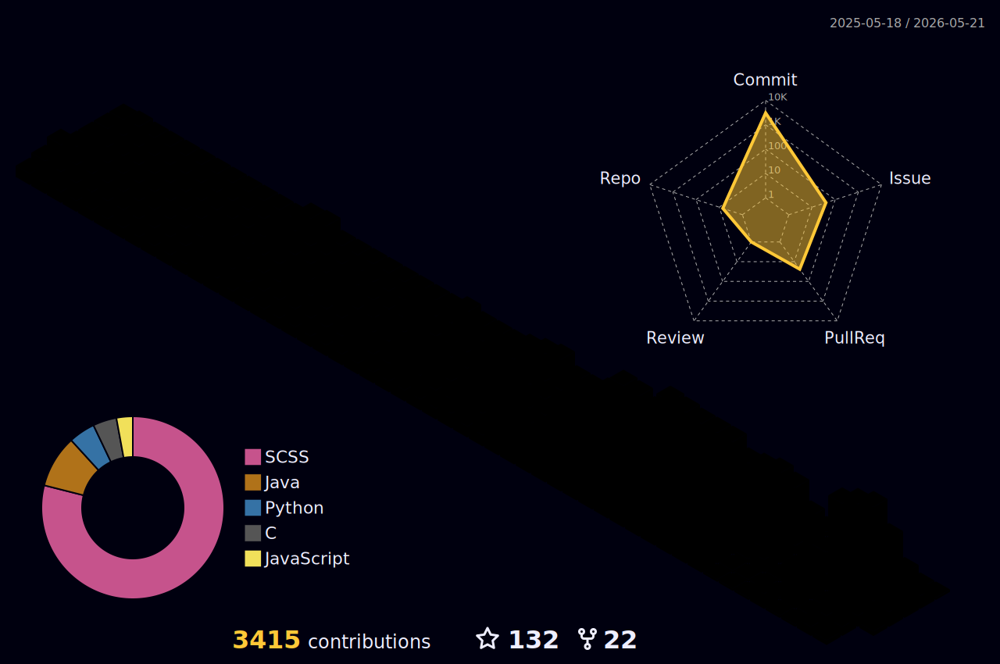

<h1 align="center">
  Hi there, I'm Tugamer89!
</h1>

<h3 align="center">A student passionate about Computer Science 💻, Programming 👨‍💻, and Cybersecurity 🔒</h3>

<p align="center">
  
  
  
  <a href="https://github.com/sponsors/Tugamer89"></a>
</p>

---

<table align="center" style="border-collapse: collapse; border: none;">
  <tr style="border: none;">
    <td align="center" style="border: none;">
      
    </td>
  </tr>
</table>

### 🛠️ Languages and Tools

<p align="center">
  <a href="https://skillicons.dev">
    
  </a>
</p>

---

### 📊 GitHub & WakaTime Stats

<details open>
<summary><b>📈 Clicca per vedere le mie metriche GitHub</b></summary>
<br/>

<p align="center">
  
  
</p>

<p align="center">
  
</p>

<p align="center">
  
  
  
</p>

</details>

<br>

<table align="center" style="border: none;">
  <tr>
    <td align="center" style="border: none; vertical-align: top;">
      <h4>⏰ WakaTime Coding Activity</h4>
<!--START_SECTION:waka-->
<!--END_SECTION:waka-->
    </td>
    <td align="center" style="border: none; vertical-align: top;">
      
    </td>
  </tr>
</table>

---

### 🐍 Contribution Snake & 3D Profile

<p align="center">
  
</p>

<p align="center">
  
</p>

---

<h4 align="center">
  
```diff
+@ @ @ @ @ @ @ @ @ @ @ @ @ @ @ @ @ @ @ @ @ @ @ @ @ @ @ @+
@@       o o                                           @@
@@       | |                                           @@
@@      _L_L_                                          @@
@@   ❮\/__-__\/❯ Programming isn't about what you know @@
@@   ❮(|~o.o~|)❯  It's about what you can figure out   @@
@@   ❮/ \`-'/ \❯                                       @@
@@     _/`U'\_                                         @@
@@    ( .   . )     .----------------------------.     @@
@@   / /     \ \    | while(!(try() == SUCCEED)) |     @@
@@   \ |  ,  | /    '----------------------------'     @@
@@    \|=====|/                                        @@
@@     |_.^._|                                         @@
@@     | |"| |                                         @@
@@     ( ) ( )   Testing leads to failure              @@
@@     |_| |_|   and failure leads to understanding    @@
@@ _.-' _j L_ '-._                                     @@
@@(___.'     '.___)                                    @@
+@ @ @ @ @ @ @ @ @ @ @ @ @ @ @ @ @ @ @ @ @ @ @ @ @ @ @ @+
```

</h4>

<div align="center">
  <h3>Show some ❤️ by starring some of the repositories!</h3>
</div>
