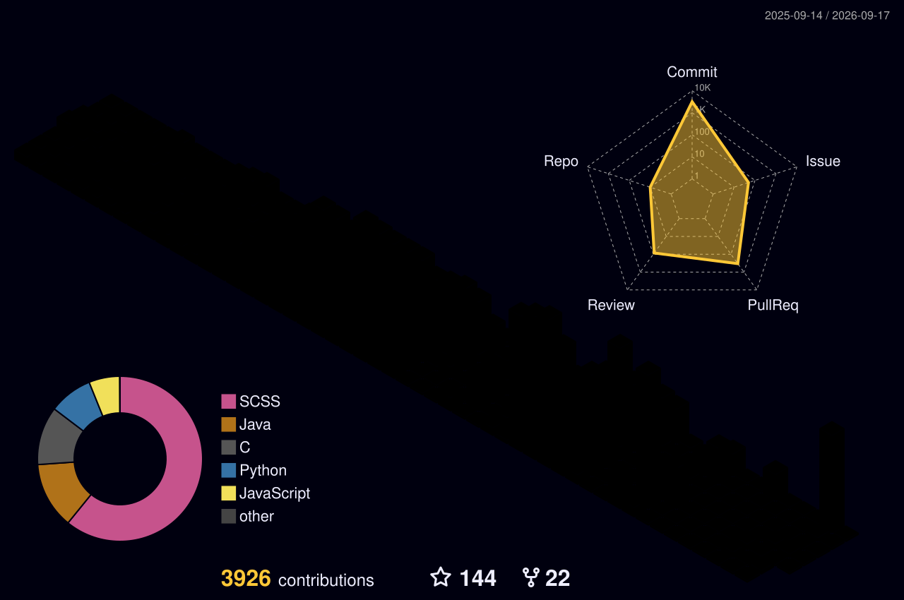

<h1 align="center">
  Hi there, I'm Tugamer89!
</h1>

<h3 align="center">A student passionate about Computer Science 💻, Programming 👨‍💻, and Cybersecurity 🔒</h3>

<p align="center">
  
  
  
  <a href="https://github.com/sponsors/Tugamer89"></a>
</p>

---

<table align="center" style="border-collapse: collapse; border: none;">
  <tr style="border: none;">
    <td align="center" style="border: none;">
      
    </td>
  </tr>
</table>

### 🛠️ Languages and Tools

<p align="center">
  <a href="https://skillicons.dev">
    
  </a>
</p>

---

### 📊 GitHub & WakaTime Stats

<details open>
<summary><b>📈 Click to view my GitHub metrics</b></summary>
<br/>

<p align="center">
  
  
</p>

<p align="center">
  
</p>

<p align="center">
  
  
  
</p>

</details>

<br>

<h4 align="center">⏰ WakaTime Coding Activity</h4>


<!--START_SECTION:waka-->


**🐱 My GitHub Data** 

> 📦 453.1 kB Used in GitHub's Storage 
 > 
> 🏆 3,064 Contributions in the Year 2026
 > 
> 💼 Opted to Hire
 > 
> 📜 25 Public Repositories 
 > 
> 🔑 18 Private Repositories 
 > 
**I'm a Night 🦉** 

```text
🌞 Morning                2204 commits        █████░░░░░░░░░░░░░░░░░░░░   19.99 % 
🌆 Daytime                3278 commits        ███████░░░░░░░░░░░░░░░░░░   29.73 % 
🌃 Evening                3218 commits        ███████░░░░░░░░░░░░░░░░░░   29.19 % 
🌙 Night                  2326 commits        █████░░░░░░░░░░░░░░░░░░░░   21.10 % 
```
📅 **I'm Most Productive on Monday** 

```text
Monday                   1815 commits        ████░░░░░░░░░░░░░░░░░░░░░   16.46 % 
Tuesday                  1547 commits        ████░░░░░░░░░░░░░░░░░░░░░   14.03 % 
Wednesday                1514 commits        ███░░░░░░░░░░░░░░░░░░░░░░   13.73 % 
Thursday                 1509 commits        ███░░░░░░░░░░░░░░░░░░░░░░   13.69 % 
Friday                   1671 commits        ████░░░░░░░░░░░░░░░░░░░░░   15.16 % 
Saturday                 1373 commits        ███░░░░░░░░░░░░░░░░░░░░░░   12.45 % 
Sunday                   1597 commits        ████░░░░░░░░░░░░░░░░░░░░░   14.48 % 
```


📊 **This Week I Spent My Time On** 

```text
🕑︎ Time Zone: Europe/Rome

💬 Programming Languages: 
Python                   22 mins             ████████░░░░░░░░░░░░░░░░░   33.85 % 
Markdown                 19 mins             ███████░░░░░░░░░░░░░░░░░░   29.12 % 
TypeScript               12 mins             █████░░░░░░░░░░░░░░░░░░░░   18.47 % 
Text                     6 mins              ██░░░░░░░░░░░░░░░░░░░░░░░   09.97 % 
YAML                     5 mins              ██░░░░░░░░░░░░░░░░░░░░░░░   08.08 % 

🔥 Editors: 
VS Code                  1 hr 6 mins         █████████████████████████   100.00 % 

🐱‍💻 Projects: 
AC-Virtual-Engineer      1 hr 6 mins         █████████████████████████   100.00 % 

💻 Operating System: 
WSL                      1 hr 6 mins         █████████████████████████   100.00 % 
```

🤖 **AI Coding This Week** 

```text
No AI Coding Activity Tracked This Week
```

**I Mostly Code in C++** 

```text
C                        7 repos             ████░░░░░░░░░░░░░░░░░░░░░   17.07 % 
Python                   6 repos             ████░░░░░░░░░░░░░░░░░░░░░   14.63 % 
JavaScript               5 repos             ███░░░░░░░░░░░░░░░░░░░░░░   12.20 % 
Java                     3 repos             ██░░░░░░░░░░░░░░░░░░░░░░░   07.32 % 
SCSS                     2 repos             █░░░░░░░░░░░░░░░░░░░░░░░░   04.88 % 
```


 Last Updated on 11/08/2026 07:51:52 UTC
<!--END_SECTION:waka-->

---

### 🐍 Contribution Snake & 3D Profile

<p align="center">
  
</p>

<p align="center">
  
</p>

---

<div align="center">
  <h3>Show some ❤️ by starring some of the repositories!</h3>
</div>
