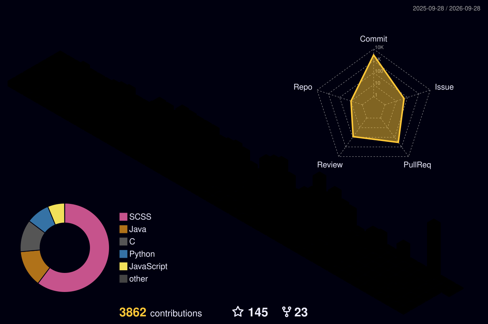

<h1 align="center">
  Hi there, I'm Tugamer89!
</h1>

<h3 align="center">A student passionate about Computer Science 💻, Programming 👨‍💻, and Cybersecurity 🔒</h3>

<p align="center">
  
  
  
  <a href="https://github.com/sponsors/Tugamer89"></a>
</p>

---

<table align="center" style="border-collapse: collapse; border: none;">
  <tr style="border: none;">
    <td align="center" style="border: none;">
      
    </td>
  </tr>
</table>

### 🛠️ Languages and Tools

<p align="center">
  <a href="https://skillicons.dev">
    
  </a>
</p>

---

### 📊 GitHub & WakaTime Stats

<details open>
<summary><b>📈 Click to view my GitHub metrics</b></summary>
<br/>

<p align="center">
  
  
</p>

<p align="center">
  
</p>

<p align="center">
  
  
  
</p>

</details>

<br>

<h4 align="center">⏰ WakaTime Coding Activity</h4>


<!--START_SECTION:waka-->


**🐱 My GitHub Data** 

> 📦 457.5 kB Used in GitHub's Storage 
 > 
> 🏆 3,235 Contributions in the Year 2026
 > 
> 💼 Opted to Hire
 > 
> 📜 26 Public Repositories 
 > 
> 🔑 18 Private Repositories 
 > 
**I'm a Night 🦉** 

```text
🌞 Morning                2171 commits        █████░░░░░░░░░░░░░░░░░░░░   19.63 % 
🌆 Daytime                3262 commits        ███████░░░░░░░░░░░░░░░░░░   29.49 % 
🌃 Evening                3344 commits        ████████░░░░░░░░░░░░░░░░░   30.23 % 
🌙 Night                  2285 commits        █████░░░░░░░░░░░░░░░░░░░░   20.66 % 
```
📅 **I'm Most Productive on Monday** 

```text
Monday                   1795 commits        ████░░░░░░░░░░░░░░░░░░░░░   16.23 % 
Tuesday                  1539 commits        ███░░░░░░░░░░░░░░░░░░░░░░   13.91 % 
Wednesday                1521 commits        ███░░░░░░░░░░░░░░░░░░░░░░   13.75 % 
Thursday                 1504 commits        ███░░░░░░░░░░░░░░░░░░░░░░   13.60 % 
Friday                   1603 commits        ████░░░░░░░░░░░░░░░░░░░░░   14.49 % 
Saturday                 1350 commits        ███░░░░░░░░░░░░░░░░░░░░░░   12.20 % 
Sunday                   1750 commits        ████░░░░░░░░░░░░░░░░░░░░░   15.82 % 
```


📊 **This Week I Spent My Time On** 

```text
🕑︎ Time Zone: Europe/Rome

💬 Programming Languages: 
Agda                     4 hrs 28 mins       ██████████████████░░░░░░░   71.65 % 
C                        1 hr 41 mins        ███████░░░░░░░░░░░░░░░░░░   27.12 % 
Markdown                 3 mins              ░░░░░░░░░░░░░░░░░░░░░░░░░   00.85 % 
Python                   0 secs              ░░░░░░░░░░░░░░░░░░░░░░░░░   00.25 % 
Git Config               0 secs              ░░░░░░░░░░░░░░░░░░░░░░░░░   00.10 % 

🔥 Editors: 
VS Code                  6 hrs 14 mins       █████████████████████████   100.00 % 

🐱‍💻 Projects: 
tests                    4 hrs 33 mins       ██████████████████░░░░░░░   72.93 % 
FM                       1 hr 41 mins        ███████░░░░░░░░░░░░░░░░░░   27.07 % 

💻 Operating System: 
WSL                      6 hrs 14 mins       █████████████████████████   100.00 % 
```

🤖 **AI Coding This Week** 

```text
No AI Coding Activity Tracked This Week
```

**I Mostly Code in C++** 

```text
C                        7 repos             ████░░░░░░░░░░░░░░░░░░░░░   16.67 % 
Python                   6 repos             ████░░░░░░░░░░░░░░░░░░░░░   14.29 % 
JavaScript               5 repos             ███░░░░░░░░░░░░░░░░░░░░░░   11.90 % 
SCSS                     2 repos             █░░░░░░░░░░░░░░░░░░░░░░░░   04.76 % 
Agda                     1 repo              █░░░░░░░░░░░░░░░░░░░░░░░░   02.38 % 
```


 Last Updated on 09/10/2026 22:54:41 UTC
<!--END_SECTION:waka-->

---

### 🐍 Contribution Snake & 3D Profile

<p align="center">
  
</p>

<p align="center">
  
</p>

---

<div align="center">
  <h3>Show some ❤️ by starring some of the repositories!</h3>
</div>
